  <picture>
    <source media="(prefers-color-scheme: dark)" srcset="./dark.svg">
    <source media="(prefers-color-scheme: light)" srcset="./light.svg">
    
  </picture>

  <a href="https://www.adeelsayyad.tech">Portfolio</a>
  &nbsp; • &nbsp;
  <a href="https://www.linkedin.com/in/adeelsayyad/">LinkedIn</a>
  &nbsp; • &nbsp;
  <a href="https://github.com/SayyadAdeel-a?tab=repositories">Repositories</a>

---

### 👋 A little about me

I get curious about random things, try to figure out how they work, and eventually attempt to build something out of them.

Most of my experiments involve AI tools, a little creativity, and a lot of trial and error.

Sometimes things work. Sometimes I create more problems than I solve. :)

### 🕸️ Currently exploring

`AI Agents` · `Prototyping` · `Product Ideas` · `Creative Experiments`

---

  <i>Still learning. Still experimenting. Still figuring things out.</i>

  
